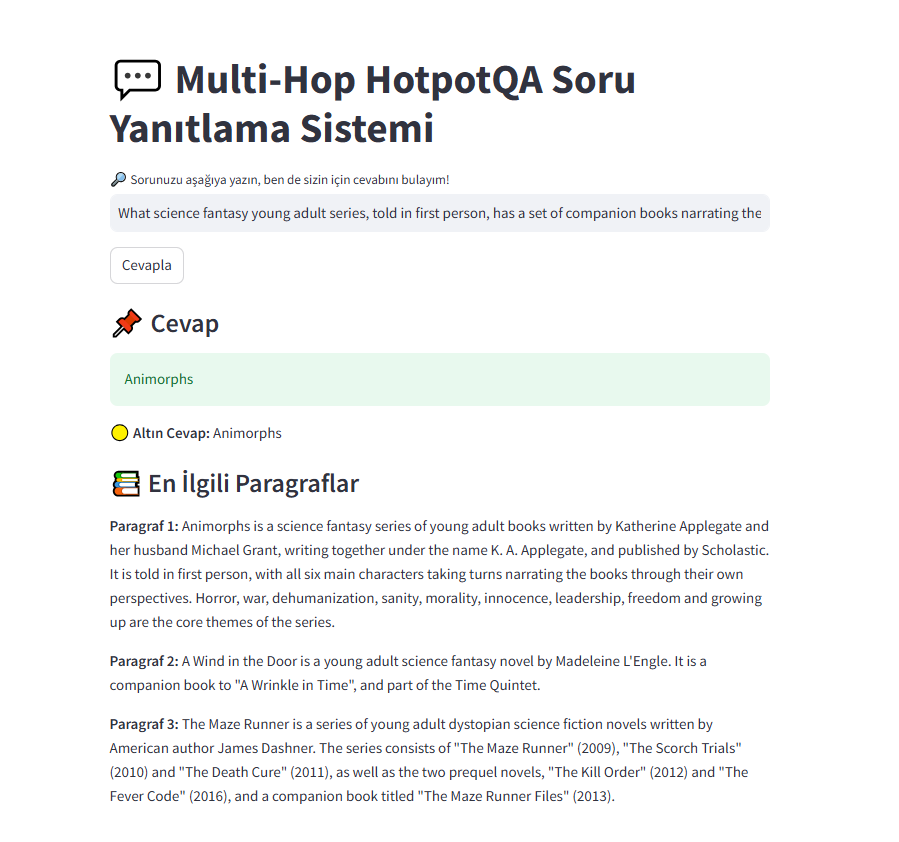

# 💬 Multi-Hop HotpotQA Soru Yanıtlama Sistemi

Bu proje, [HotpotQA](https://hotpotqa.github.io/) veri seti üzerinde çalışan *RAG (Retrieval-Augmented Generation)* tabanlı bir soru yanıtlama sistemidir. Kullanıcıdan alınan soruya uygun olarak en ilgili paragrafları bulur ve ardından T5 tabanlı bir jeneratif modelle cevap üretir.

## 🚀 Özellikler

    🔍 *Soru-Cevap*: Kullanıcının girdiği soruya en uygun yanıtı üretir.
    📚 *Paragraf Getirme*: FAISS ve SentenceTransformer kullanarak ilgili bağlamları bulur.
    🧠 *Model*: google/flan-t5-large jeneratif dil modeli ile cevap üretir.
    ⚡ *Hızlı*: FAISS ile hızlı vektör arama, GPU desteği (varsa) ile hızlı cevaplama.
    🎨 *Arayüz*: Streamlit tabanlı kullanıcı dostu görsel arayüz.

## 🔍 Kullanılan Veri Seti: HotpotQA

- **HotpotQA** yaklaşık 113.000 soru-cevap örneği içerir.
- **Distractor** sürümü kullanılmıştır: her soruya ait 2 doğru paragraf ve 8 dikkat dağıtıcı paragraf içerir.
- Veri yapısı:
  - `question`, `answer`, `context`, `supporting_facts`, `type`, `level`
- Model yalnızca cevabı değil, cevabın hangi cümlelerden üretildiğini de tahmin eder.

---

## 🛠️ Sistemler

### ⚙️ RAG Sistemi 1

#### 🔧 Bileşenler:
- **Retriever:** `intfloat/e5-large-v2`
- **Generator:** `google/flan-t5-base` ve `google/flan-t5-large`
- **Reranker:** `cross-encoder/stsb-roberta-base`

#### 🧠 Özellikler:
- FAISS: `IndexHNSWFlat`
- Chunking: 200 token’lık metin parçalama
- Stopword temizleme, lemmatization, özel karakter temizleme
- GPU desteği
- Reranking sistemi sayesinde en iyi 5 sonuç seçimi
- Bellek optimizasyonu ve FAISS index kaydı

#### 📈 Değerlendirme Metrikleri:
- BLEU, ROUGE-1/2/L, METEOR, F1 Score
- Supporting Fact Match
- Retrieval Score

---

### ⚙️ RAG Sistemi 2

#### 🔧 Bileşenler:
- **Retriever:** `sentence-transformers/all-MiniLM-L6-v2`
- **Generator:** `google/flan-t5-base` ve `google/flan-t5-large`
- **Reranker:** Yok

#### 🧠 Özellikler:
- FAISS: `IndexFlatIP`
- Embedding normalizasyonu
- Batch işleme (32’lik batch’ler)
- Pickle ile FAISS indeks yönetimi
- Bellek dostu, optimize veri işleme

#### 📈 Değerlendirme Metrikleri:
- BLEU, ROUGE-1/2/L, METEOR, F1 Score

---

### ⚙️ RAG Sistemi 3

#### 🔧 Bileşenler:
- **Retriever:** `intfloat/e5-large-v2`
- **Generator:** `google/flan-t5-base` ve `google/flan-t5-large`
- **Reranker:** Yok

#### 🧠 Özellikler:
- FAISS: `IndexFlatL2` (Öklid uzaklığı)
- En sade yapı: fonksiyonel ve doğrusal
- Her soru için embedding oluşturulur, top_k paragraf seçilir
- GPU kontrolü ve paragraf eşleme haritası ile analiz kolaylığı
- Bellek yönetimi basit

#### 📈 Değerlendirme Metrikleri:
- F1 Score
- ROUGE-L
- Cosine Similarity
- Supporting Fact Match
- Retrieval Score

---

## 📊 Karşılaştırmalar

| Özellik                       | RAG 1          | RAG 2          | RAG 3          |
|-----------------------------|----------------|----------------|----------------|
| Yapı                         | Sınıf Tabanlı  | Sınıf Tabanlı  | Fonksiyonel    |
| Kod Organizasyonu            | Modüler        | Modüler        | Doğrusal       |
| Reranking                    | ✅              | ❌              | ❌              |
| Bellek Optimizasyonu         | Gelişmiş       | İyi            | Basit          |
| Chunking                     | ✅              | ❌              | ❌              |
| Değerlendirme Metrikleri     | BLEU, ROUGE, METEOR, F1 | BLEU, ROUGE, METEOR, F1 | ROUGE-L, F1, Cosine |
| Arayüz                       | Var            | Var            | Yok            |

---

## 🏁 Sonuçlar

| Sistem         | FLAN-T5 Base (ROUGE-L) | FLAN-T5 Large (ROUGE-L) | Güçlü Yönler                                  | Zayıf Yönler                                |
|----------------|-------------------------|--------------------------|-----------------------------------------------|---------------------------------------------|
| RAG Sistem 1   | %28.11                  | %31.33                   | Gelişmiş yapı, metin işleme, Reranking        | Karmaşık ve kaynak tüketimi yüksek          |
| RAG Sistem 2   | %33.75                  | %37.76                   | Anlaşılır yapı, bellek dostu                  | Reranker yok, metrik çeşitliliği az         |
| RAG Sistem 3   | %50.18                  | %55.42                   | En hızlı ve sade yapı                         | Optimizasyon ve metrik eksikliği            |

---

## 💡 Genel Değerlendirme

- **RAG Sistem 1**, detaylı analiz ve metin işleme gerektiren durumlar için uygundur.
- **RAG Sistem 2**, daha hafif yapısıyla bellek dostu çözümler sunar.
- **RAG Sistem 3**, hızlı prototipleme ve temel performans için idealdir.

---

## 🖼️ Arayüz Görselleri

### Ana Sayfa (Soru sorulmadan önce)

### Cevaplama Ekranı (Soru sorulduktan sonra)

## 🧩 Kullanılan Teknolojiler

| Bileşen             | Açıklama                                       |
|---------------------|------------------------------------------------|
| Streamlit           | Web tabanlı arayüz                             |
| SentenceTransformers| Soru ve metin gömme işlemi                     |
| FAISS               | Paragraf vektörleri üzerinde hızlı arama       |
| Transformers        | T5 tabanlı jeneratif model (flan-t5-large)  |
| HotpotQA            | Çok adımlı mantıksal çıkarım gerektiren veri seti |

## 📌 Kaynakça
- [HotpotQA Dataset](https://hotpotqa.github.io/)
- [FAISS Documentation](https://faiss.ai/)
- [HuggingFace Models](https://huggingface.co/models)
